# Encryption Lab

**Author:** Sonny Ngo

---

## Task 1: Encryption Using Different Ciphers and Modes

### Step 1: ECB — change any one bit and decrypt

I encrypted the `logins_trimmed.txt` file (trimmed to 256 bytes from the original `logins.txt`) using AES-128 ECB with the command below.

<p float="left">
  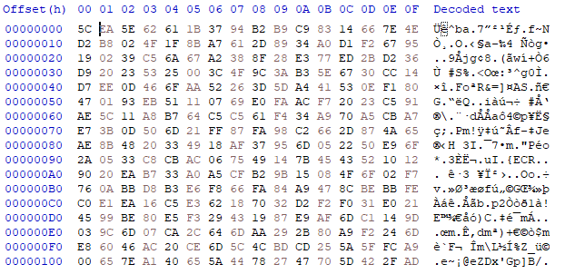
  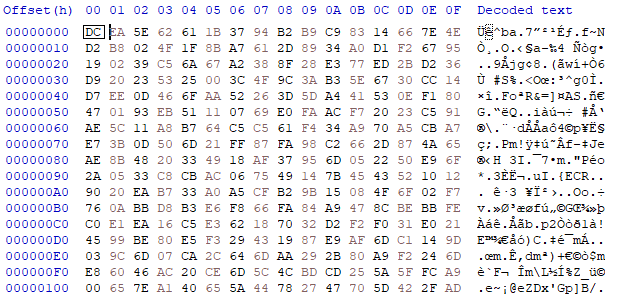
</p>

```
& "C:\Program Files\Git\usr\bin\openssl.exe" enc -aes-128-ecb -e -in logins_trimmed.txt -out cipher_ecb.bin -K 00112233445566778899aabbccddeeff
```

The first bit was changed from `5C` to `DC` using HxD, since `0101 1100` → `1101 1100`. The screenshots are above. After changing the bit, I saved the new file as `cipher_ecb_step1.bin`.

I then used the following command to decrypt the file I corrupted:

```
openssl enc -aes-128-ecb -d -in cipher_ecb_step1.bin -out decrypted_ecb_step1.txt -K 00112233445566778899aabbccddeeff
```

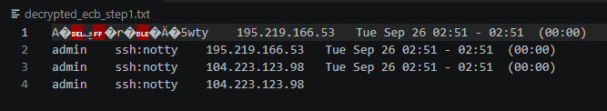

You can see from the above screenshot that only the first block was corrupted, as ECB should behave.

The screenshot below is the decrypted file `decrypted_ecb_step1.txt` in HxD:

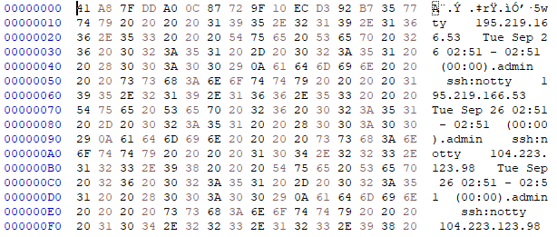

**1. What information (plain text) was recovered after decryption and what was lost?**

- **Recovered:** Everything except the first 16 bytes. From byte 16 onward, the text is perfect and all the log entries after the first one are untouched.
- **Lost:** The first 16 bytes turned into complete garbage (`41 A8 7F DD A0 0C 87 72 9F 10 EC D3 92 B7 35 77`) instead of `"admin    ssh:not"`.

**2. Why data was lost or recovered:**

In ECB mode, each 16-byte block is decrypted completely on its own — blocks don't affect each other at all. So when you corrupt 1 bit in block 1's ciphertext, only block 1 breaks (and breaks completely, since AES scrambles a whole block if even one input bit changes). Every other block was never touched, so they all decrypt perfectly.

---

### Step 2: CBC — change the 1st bit of the file and decrypt

*(I know the screenshots aren't mandatory, but I already documented it before realizing.)*

Since I'm using PowerShell in VSCode, I set the Key and IV using the following commands, with the output shown in the screenshot below.

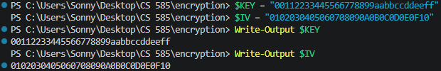

I used the command below to encrypt the original `logins_trimmed.txt` file to a file called `cipher_cbc.bin`:

```
openssl enc -aes-128-cbc -e -in logins_trimmed.txt -out cipher_cbc.bin -K $KEY -iv $IV
```

I then used HxD to flip the first bit from `0B` to `8B`, shown in the screenshots below. After flipping it, I saved the file as `cipher_cbc_step2.bin`.

<p float="left">
  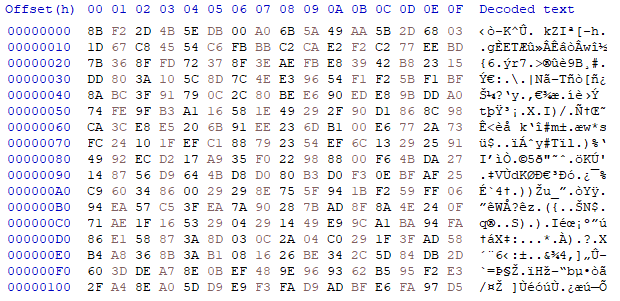
  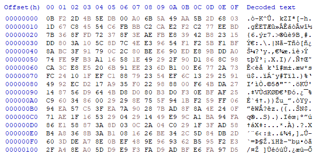
</p>

I then used the command below to decrypt the file:

```
openssl enc -aes-128-cbc -d -in cipher_cbc_step2.bin -out decrypted_cbc_step2.txt -K $KEY -iv $IV
```

The screenshot below shows the decrypted CBC file, `decrypted_cbc_step2`, for step 2 in HxD:

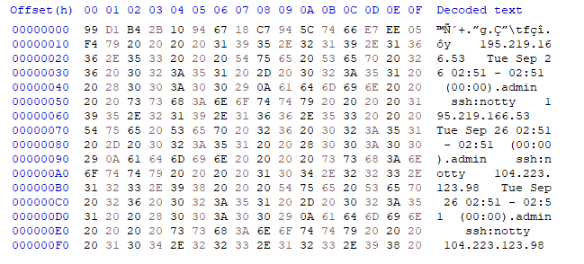

**1. What information (plain text) was recovered after decryption and what was lost?**

**2. Why data was lost or recovered:**

Everything from byte 17 onward (the vast majority of the file) decrypts perfectly. For the info lost/altered: block 1 (bytes 0–15, `"admin    ssh:not"`) is completely unrecoverable. Byte 16 (the first byte of block 2) has exactly 1 bit flipped, changing `t` to an unprintable character, but is otherwise recognizable/adjacent to correct data. The CBC decryption formula `P_i = D(C_i) XOR C_{i-1}` means a corrupted ciphertext block is destroyed by the block cipher's avalanche effect when decrypted directly, but it also gets XORed unchanged into the *next* block's plaintext, causing only a matching single-bit error there. All blocks after that recover normally since they don't depend on the corrupted ciphertext at all.

---

### Step 4: CBC — change the last bit of the file and decrypt

In my CBC file, I changed the last bit of the file from `D5`, shown in the screenshot below:

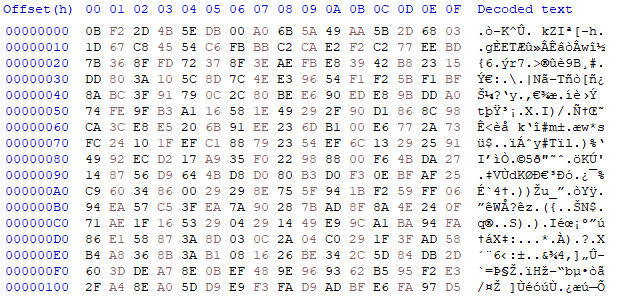

To `D4`, shown in the screenshot below. I saved the file as `cipher_cbc_step4.bin`.

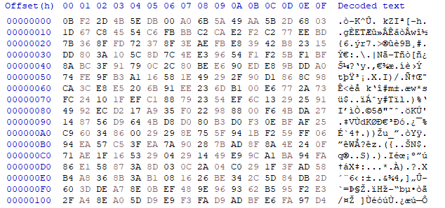

I used the command below to decrypt the changed file to `decrypted_cbc_step4.txt`:

```
openssl enc -aes-128-cbc -d -in cipher_cbc_step4.bin -out decrypted_cbc_step4.txt -K $KEY -iv $IV
```

I then received the following error message, shown in the screenshot below:

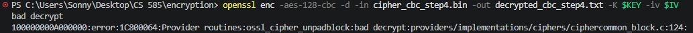

This is the screenshot of the decrypted file:

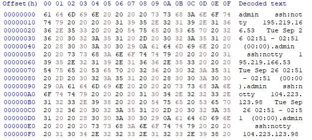

Even though the terminal shows an error, OpenSSL still wrote the output file. Opening `decrypted_cbc_step4.txt` in my hex editor anyway: all 256 bytes of actual data decrypted perfectly. The error only reflects the invisible padding block failing its check, not any real information being lost.

**1. What information (plain text) was recovered after decryption and what was lost?**

All 256 bytes of real plaintext data were recovered perfectly, meaning nothing meaningful was lost. Only the invisible PKCS#7 padding block (which carries no actual information, just block-alignment filler) was corrupted.

**2. Why data was lost or recovered:**

My plaintext was exactly 256 bytes (an exact multiple of the 16-byte block size), so CBC's PKCS#7 padding added a full extra block of padding-only bytes before encrypting. Flipping the last bit of ciphertext only corrupted that invisible padding block, not any real data block. OpenSSL's decryption process checks that the final block decodes to valid padding before returning success. Since that check failed, it threw a `bad decrypt` error and exited nonzero, even though every byte of actual message content decrypted correctly underneath.

---

### Step 6: CFB — change the 129th bit of the file and decrypt

I first encrypted `logins_trimmed.txt` using CFB with the following command:

```
openssl enc -aes-128-cfb -e -in logins_trimmed.txt -out cipher_cfb.bin -K $KEY -iv $IV
```

<p float="left">
  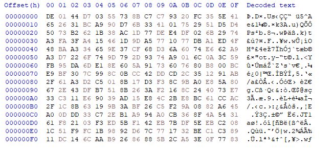
  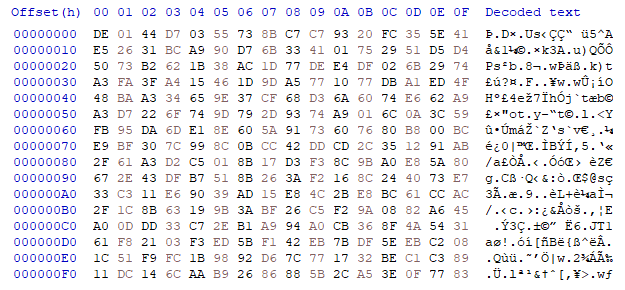
</p>

I changed the 129th bit of the file (`E5` → `65`) in HxD and saved it as `cipher_cfb_step6.bin`, as shown in the screenshots above.

I then decrypted the modified file using the command:

```
openssl enc -aes-128-cfb -d -in cipher_cfb_step6.bin -out decrypted_cfb_step6.txt -K $KEY -iv $IV
```

The screenshot below shows the decrypted file `decrypted_cfb_step6.txt`:

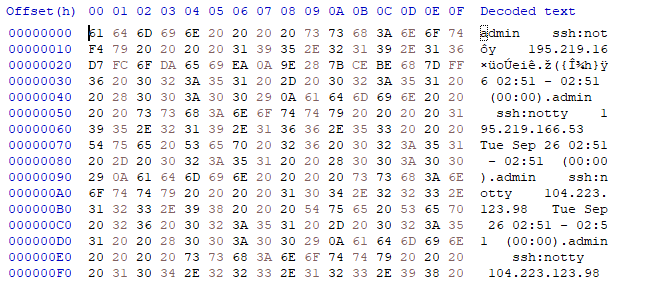

- **Bytes 0–15:** good — `"admin    ssh:not"`
- **Byte 16:** a single-bit error (`F4` instead of `74`, just the top bit flipped)
- **Bytes 17–31:** good — `"y    195.219.16"`
- **Bytes 32–47:** completely scrambled — `D7 FC 6F DA 65 69 EA 0A 9E 28 7B CE BE 68 7D FF`
- **Bytes 48 onward:** everything is good again — `"6 02:51 - 02:51 ..."` and everything after reads correctly all the way to the end

**1. What information (plain text) was recovered after decryption and what was lost?**

- **Recovered:** Almost the whole file — bytes 0–15, byte 16 (mostly, off by 1 bit), bytes 17–31, and everything from byte 48 to the end.
- **Lost:** Bytes 32–47 (one full 16-byte block) turned into unreadable garbage. Byte 16 also came out slightly wrong — just 1 bit flipped, so it's a broken character but not full garbage.

**2. Why data was lost or recovered:**

I flipped 1 bit in the ciphertext at byte 16. In CFB mode, that same byte (16) only gets a single matching bit flip in the decrypted output, meaning it doesn't get destroyed, because that ciphertext byte is XORed directly with a keystream to make the plaintext.

However, that same corrupted ciphertext byte is also used to generate the keystream for the next block (bytes 32–47). Since generating a keystream involves running the byte through AES, even a 1-bit change completely scrambles that whole next block.

Every block after that (byte 48+) is generated from *uncorrupted* ciphertext, so it recovers perfectly.

> In layman's terms: the block you edit only gets a tiny 1-bit error, but the block right after it gets completely destroyed; then everything recovers after that.

---

### Step 10: OFB — change the last bit of the file and decrypt

I ran the command below to encrypt the original `logins_trimmed.txt` to a file called `cipher_ofb.bin`. The screenshot of the encrypted file is below:

```
openssl enc -aes-128-ofb -e -in logins_trimmed.txt -out cipher_ofb.bin -K $KEY -iv $IV
```

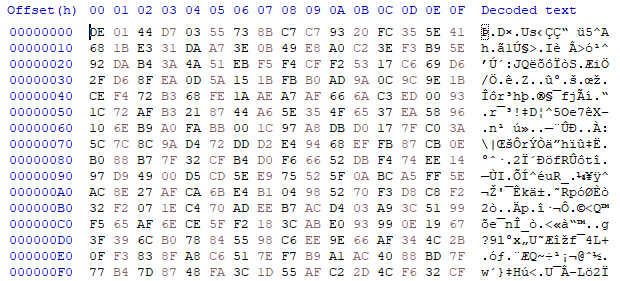

I then changed the last bit of the file from `CF` to `CE` and saved the file as `cipher_ofb_step10.bin`.

I then used the command below to decrypt the changed file, shown in the screenshot below:

```
openssl enc -aes-128-ofb -d -in cipher_ofb_step10.bin -out decrypted_ofb_step10.txt -K $KEY -iv $IV
```

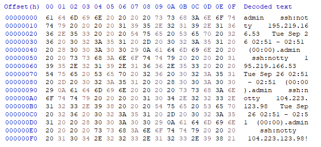

The very last byte now decodes to `!` (`21`) instead of a space (`20`). Everything else, from byte 0 all the way to the second-to-last byte, is untouched and perfectly readable, including the final `"...104.223.123.98"` text right up to that last character.

**1. What information (plain text) was recovered after decryption and what was lost?**

- **Recovered:** The entire file, all 255 bytes of it, decrypted perfectly. Every username, IP address, and timestamp is intact.
- **Lost:** Only the very last byte was affected, and even then only barely — the trailing space character became `!` instead. That's the only piece of information altered in the whole file.

**2. Why data was lost or recovered:**

In OFB mode, the keystream used to decrypt each byte is generated independently of the ciphertext itself — it only depends on the key and IV, run through AES repeatedly ahead of time. Since flipping a ciphertext bit doesn't feed back into generating any keystream, corrupting the last byte of ciphertext only flips the same single bit in that one corresponding plaintext byte, and nothing more — nothing before or after it is touched at all.

OFB's errors never spread: a 1-bit ciphertext error always produces exactly a 1-bit plaintext error, in that same byte only, no matter where in the file it happens.

---

## Task 2: Encryption Modes — ECB vs. CBC and Padding


I first attempted to encrypt the `Tux.jpg` file using OpenSSL and 128-bit ECB mode:

```
openssl enc -aes-128-ecb -e -in Tux.jpg -out Tux_encrypted_whole.jpg -K 0123456789abcdef0123456789abcdef
```

When attempting to display the file with an image viewer, it showed the following:

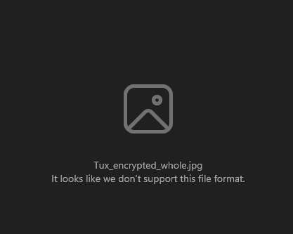

With the script, you can use the following commands to encrypt the images using ECB and CBC:

```
python encrypt_image.py -i Tux.jpg -o Tux_ecb.png -k 0123456789abcdef -m AES_ECB
python encrypt_image.py -i Tux.jpg -o Tux_cbc.png -k 0123456789abcdef -m AES_CBC

python encrypt_image.py -i whoisCB2.jpg -o whoisCB2_ecb.png -k 0123456789abcdef -m AES_ECB
python encrypt_image.py -i whoisCB2.jpg -o whoisCB2_cbc.png -k 0123456789abcdef -m AES_CBC

python encrypt_image.py -i pic_original.bmp -o pic_original_ecb.png -k 0123456789abcdef -m AES_ECB
python encrypt_image.py -i pic_original.bmp -o pic_original_cbc.png -k 0123456789abcdef -m AES_CBC
```

### Tux.jpg

| Original | Encrypted (ECB) | Encrypted (CBC) |
|---|---|---|
|  | 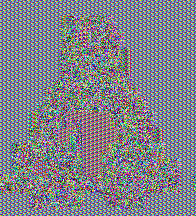 |  |

### whoisCB2.jpg

| Original | Encrypted (ECB) | Encrypted (CBC) |
|---|---|---|
|  |  |  |

### pic_original (basic shapes)

| Original | Encrypted (ECB) | Encrypted (CBC) |
|---|---|---|
|  |  |  |
